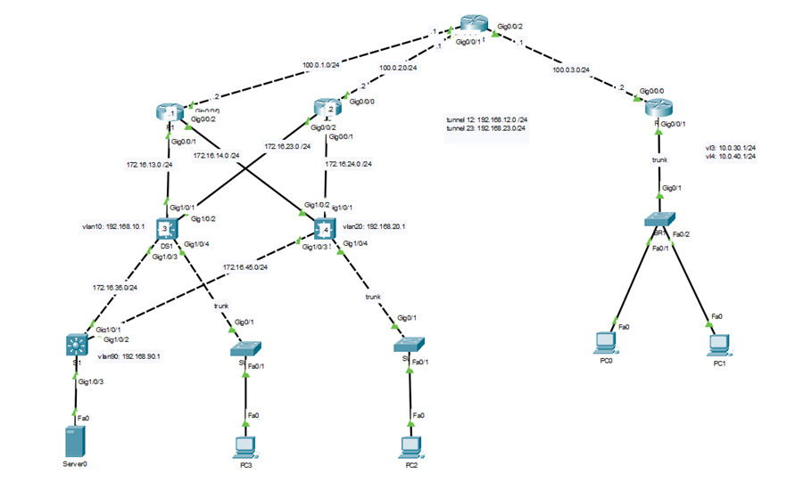

## Lab Intruction Step by Step



#### 0. Configure IP addresses for Internet router

```
Internet(config)#int g0/0/0
Internet(config-if)#ip add 100.0.1.1 255.255.255.0
Internet(config-if)#no shut
Internet(config-if)#int g0/0/1
Internet(config-if)#ip add 100.0.2.1 255.255.255.0
Internet(config-if)#no shut
Internet(config-if)#int g0/0/2
Internet(config-if)#ip add 100.0.3.1 255.255.255.0
Internet(config-if)#no shut
Internet(config-if)#int lo0
Internet(config-if)#ip add 8.8.8.8 255.255.255.255
```

#### 1. Configure IP addresses for the devices as shown in the topology diagram.

```
R1(config)#int g0/0/0
R1(config-if)#ip add 100.0.1.2 255.255.255.0
R1(config-if)#no shut
R1(config-if)#int g0/0/1
R1(config-if)#ip add 172.16.13.1 255.255.255.0
R1(config-if)#no shut
R1(config-if)#int g0/0/2
R1(config-if)#ip add 172.16.14.1 255.255.255.0
R1(config-if)#no shut
```

```
R2(config)#int g0/0/0
R2(config-if)#ip add 100.0.2.2 255.255.255.0
R2(config-if)#no shut
R2(config-if)#int g0/0/1
R2(config-if)#ip add 172.16.24.2 255.255.255.0
R2(config-if)#no shut
R2(config-if)#int g0/0/2
R2(config-if)#ip add 172.16.23.2 255.255.255.0
R2(config-if)#no shut
```

```
DS1(config)#int g1/0/1
DS1(config-if)#no sw
DS1(config-if)#ip add 172.16.13.3 255.255.255.0
DS1(config-if)#int g1/0/2
DS1(config-if)#no sw
DS1(config-if)#ip add 172.16.23.3 255.255.255.0
DS1(config-if)#int g1/0/3
DS1(config-if)#no switchport
DS1(config-if)#ip add 172.16.35.3 255.255.255.0
DS1(config-if)#int vlan 10
DS1(config-if)#ip add 192.168.10.1 255.255.255.0
```

```
DS2(config)#int g1/0/1
DS2(config-if)#no switchport
DS2(config-if)#ip add 172.16.24.4 255.255.255.0
DS2(config-if)#int g1/0/2
DS2(config-if)#no switchport
DS2(config-if)#ip add 172.16.14.4 255.255.255.0
DS2(config-if)#int g1/0/3
DS2(config-if)#no switchport
DS2(config-if)#ip add 172.16.45.4 255.255.255.0
DS2(config-if)#int vlan 20
DS2(config-if)#ip add 192.168.20.1 255.255.255.0
```

```
S1(config)#int g1/0/1
S1(config-if)#no switchport
S1(config-if)#ip add 172.16.35.5 255.255.255.0
S1(config-if)#int g1/0/2
S1(config-if)#no switchport
S1(config-if)#ip add 172.16.45.5 255.255.255.0
S1(config-if)#int vlan 90
S1(config-if)#ip add 192.168.90.1 255.255.255.0
```

```
R3(config)#int g0/0/0
R3(config-if)#ip add 100.0.3.2 255.255.255.0
R3(config-if)#no shut
R3(config-if)#int g0/0/1
R3(config-if)#no shut
R3(config-if)#int g0/0/1.3
R3(config-subif)#encapsulation dot1Q 3
R3(config-subif)#ip add 10.0.30.1 255.255.255.0
R3(config-subif)#int g0/0/1.4
R3(config-subif)#encapsulation dot1Q 4
R3(config-subif)#ip add 10.0.40.1 255.255.255.0
```

#### 2. Trunking: Configure trunk links using dot1q encapsulation on the connections indicated in the topology.

```
DS1(config)#int g1/0/4
DS1(config-if)#sw mode trunk
```

```
SW1(config)#int g0/1
SW1(config-if)#sw mode trunk
```

```
DS2(config)#int g0/1
DS2(config-if)#sw mode trunk
```

```
SW2(config)#int g0/1
SW2(config-if)#sw mode trunk
```

```
BR1(config)#int g0/1
BR1(config-if)#sw mode trunk
```

#### 3. VTP: Configure VTP on switches DS1, DS2, SW1, and SW2 using the domain cisco123, with DS1 & DS2 acting as Servers, and SW1 & SW2 acting as Clients that learn VLAN information from the Server switches.

```
DS1(config)#vtp domain cisco123
DS1(config)#vtp mode server
```

```
DS2(config)#vtp domain cisco123
DS2(config)#vtp mode server
```

```
SW1(config)#vtp domain cisco123
SW1(config)#vtp mode client
```

```
SW2(config)#vtp domain cisco123
SW2(config)#vtp mode client
```

#### 4. VLAN: create VLAN 10 on DS1, create VLAN 20 on DS2, create VLAN 90 on S1 and assign VLANs to the corresponding ports.

```
DS1(config)#vlan 10
```

```
DS2(config)#vlan 20
```

```
S1(config)#vlan 90
S1(config)#int g1/0/3
S1(config-if)#sw mode acc
S1(config-if)#sw acc vlan 90
```

```
SW1(config)#int f0/1
SW1(config-if)#sw mode acc
SW1(config-if)#sw acc vlan 10
```

```
SW2(config)#int f0/1
SW2(config-if)#sw mode acc
SW2(config-if)#sw acc vlan 20
```


#### 5. Inter-VLAN Routing: Configure VLANs on BR1 to ensure PCs in VLAN 3 can communicate with PCs in VLAN 4.

```
BR1(config)#vlan 3
BR1(config-vlan)#vlan 4
BR1(config-vlan)#exit
BR1(config)#int f0/1
BR1(config-if)#sw mode acc
BR1(config-if)#sw acc vlan 3
BR1(config-if)#int f0/2
BR1(config-if)#sw mode acc
BR1(config-if)#sw acc vlan 4
```

#### 6. Routing: Configure OSPF on devices R1, R2, DS1, DS2, and S1 to ensure network convergence; Configure a default route on R1 and R2, advertise the default route into the OSPF domain.

```
R1(config)#ip route 0.0.0.0 0.0.0.0 100.0.1.1
R1(config)#router ospf 1
R1(config-router)#router-id 0.0.0.1
R1(config-router)#network 172.16.13.0 0.0.0.255 area 0
R1(config-router)#network 172.16.14.0 0.0.0.255 area 0
R1(config-router)#default-information originate
```

```
R2(config)#ip route 0.0.0.0 0.0.0.0 100.0.2.1
R2(config)#router ospf 1
R2(config-router)#router-id 0.0.0.2
R2(config-router)#network 172.16.23.0 0.0.0.255 area 0
R2(config-router)#network 172.16.24.0 0.0.0.255 area 0
R2(config-router)#default-information originate
```

```
DS1(config)#ip routing
DS1(config)#router ospf 1
DS1(config-router)#router-id 0.0.0.3
DS1(config-router)#network 172.16.13.0 0.0.0.255 area 0
DS1(config-router)#network 172.16.23.0 0.0.0.255 area 0
DS1(config-router)#network 172.16.35.0 0.0.0.255 area 0
DS1(config-router)#network 192.168.10.0 0.0.0.255 area 0
DS1(config-router)#passive-interface vlan 10
```

```
DS2(config)#ip routing
DS2(config)#router ospf 1
DS2(config-router)#network 172.16.14.0 0.0.0.255 area 0
DS2(config-router)#network 172.16.24.0 0.0.0.255 area 0
DS2(config-router)#network 172.16.45.0 0.0.0.255 area 0
DS2(config-router)#network 192.168.20.0 0.0.0.255 area 0
DS2(config-router)#passive-interface vlan 20
```

```
S1(config)#ip routing
S1(config)#router ospf 1
S1(config-router)#router-id 0.0.0.5
S1(config-router)#network 172.16.35.0 0.0.0.255
S1(config-router)#network 172.16.45.0 0.0.0.255 area 0
S1(config-router)#network 192.168.90.0 0.0.0.255 area 0
S1(config-router)#passive-interface vlan 90
```

```
R3(config)#ip route 0.0.0.0 0.0.0.0 100.0.3.1
```

#### 7. DHCP: Configure DHCP on switch S1 to provide IP addresses to PCs in VLAN 10 and VLAN 20. Also configure DHCP on R3.

```
DS1(config)#ip dhcp pool VLAN_10
DS1(dhcp-config)#network 192.168.10.0 255.255.255.0
DS1(dhcp-config)#default-router 192.168.10.1
DS1(dhcp-config)#dns-server 8.8.8.8
DS1(dhcp-config)#exit
DS1(config)#ip dhcp pool VLAN_20
DS1(dhcp-config)#network 192.168.20.0 255.255.255.0
DS1(dhcp-config)#default-router 192.168.20.1
DS1(dhcp-config)#dns-server 8.8.8.8
```

```
DS2(config)#int vlan 20
DS2(config-if)#ip helper-address 172.16.23.3
```

```
R3(config)#ip dhcp pool VLAN_3
R3(dhcp-config)#network 10.0.30.0 255.255.255.0
R3(dhcp-config)#default-router 10.0.30.1
R3(dhcp-config)#dns-server 8.8.8.8
R3(dhcp-config)#ip dhcp pool VLAN_4
R3(dhcp-config)#network 10.0.40.0 255.255.255.0
R3(dhcp-config)#default-router 10.0.40.1
R3(dhcp-config)#dns-server 8.8.8.8
```

#### 8. NAT: Configure NAT on R1, R2, and R3 to ensure internal network devices can access the Internet.

```
R1(config)#access-list 1 permit any
R1(config)#ip nat inside source list 1 interface g0/0/0 overload
R1(config)#int g0/0/1
R1(config-if)#ip nat inside
R1(config-if)#int g0/0/2
R1(config-if)#ip nat inside
R1(config-if)#int g0/0/0
R1(config-if)#ip nat outside
```

```
R2(config)#access-list 1 permit any
R2(config)#ip nat inside source list 1 interface g0/0/0 overload
R2(config)#int g0/0/1
R2(config-if)#ip nat inside
R2(config-if)#int g0/0/2
R2(config-if)#ip nat inside
R2(config-if)#int g0/0/0
R2(config-if)#ip nat outside
```

```
R3(config)#access-list 1 permit any
R3(config)#ip nat inside source list 1 interface g0/0/0 overload
R3(config)#int g0/0/1.3
R3(config-subif)#ip nat inside
R3(config-subif)#int g0/0/1.4
R3(config-subif)#ip nat inside
R3(config-subif)#int g0/0/0
R3(config-if)#ip nat outside
```

#### 9. VPN: Configure GRE VPN on R1, R2, and R3 to ensure PCs PC3 and PC4 can access the Server through two paths.
```
R1(config)#int tunnel 12
R1(config-if)#ip add 192.168.12.1 255.255.255.0
R1(config-if)#tunnel source g0/0/0
R1(config-if)#tunnel destination 100.0.3.2
R1(config-if)#tunnel mode gre ip
```

```
R2(config)#int tunnel 23
R2(config-if)#ip add 192.168.23.1 255.255.255.0
R2(config-if)#tunnel source g0/0/0
R2(config-if)#tunnel destination 100.0.3.2
R2(config-if)#tunnel mode gre ip
```

```
R3(config)#int tunnel 12
R3(config-if)#ip add 192.168.12.2 255.255.255.0
R3(config-if)#tunnel source g0/0/0
R3(config-if)#tunnel destination 100.0.1.2
R3(config-if)#tunnel mode gre ip
R3(config-if)#int tunnel 23
R3(config-if)#ip add 192.168.23.2 255.255.255.0
R3(config-if)#tunnel source g0/0/0
R3(config-if)#tunnel destination 100.0.2.2
R3(config-if)#tunnel mode gre ip
```

```
R1(config)#ip route 10.0.0.0 255.255.0.0 192.168.12.2
```

```
R2(config)#ip route 10.0.0.0 255.255.0.0 192.168.23.2
```

```
R3(config)#ip route 192.168.90.2 255.255.255.255 192.168.12.1
R3(config)#ip route 192.168.90.2 255.255.255.255 192.168.23.1
```

#### 10. ACL: Configure an ACL on R3 so that PCs in the 10.0.30.0/24 and 10.0.40.0/24 networks can only access the Server; Configure ACLs on DS1 and DS2 so that the Server can ping the PCs, but the PCs cannot ping the Server.

```
R3(config)#ip access-list extended Block_Internet
R3(config-ext-nacl)#10 permit ip 10.0.0.0 0.0.255.255 host 192.168.90.2
R3(config-ext-nacl)#exit
R3(config)#int g0/0/1.3
R3(config-subif)#ip access-group Block_Internet
```

```
DS1(config)#ip access-list extended Block_Ping
DS1(config-ext-nacl)#10 deny icmp host 192.168.90.2 192.168.10.0 0.0.0.255 echo-reply
DS1(config-ext-nacl)#20 permit ip any any
DS1(config-ext-nacl)#int vlan 10
DS1(config-if)#ip access-group Block_Ping out
```

```
DS2(config)#ip access-list extended Block_Ping
DS2(config-ext-nacl)#10 deny icmp host 192.168.90.2 192.168.20.0 0.0.0.255 echo-reply
DS2(config-ext-nacl)#20 permit ip any any
DS2(config-ext-nacl)#int vlan 20
DS2(config-if)#ip access-group Block_Ping out
```